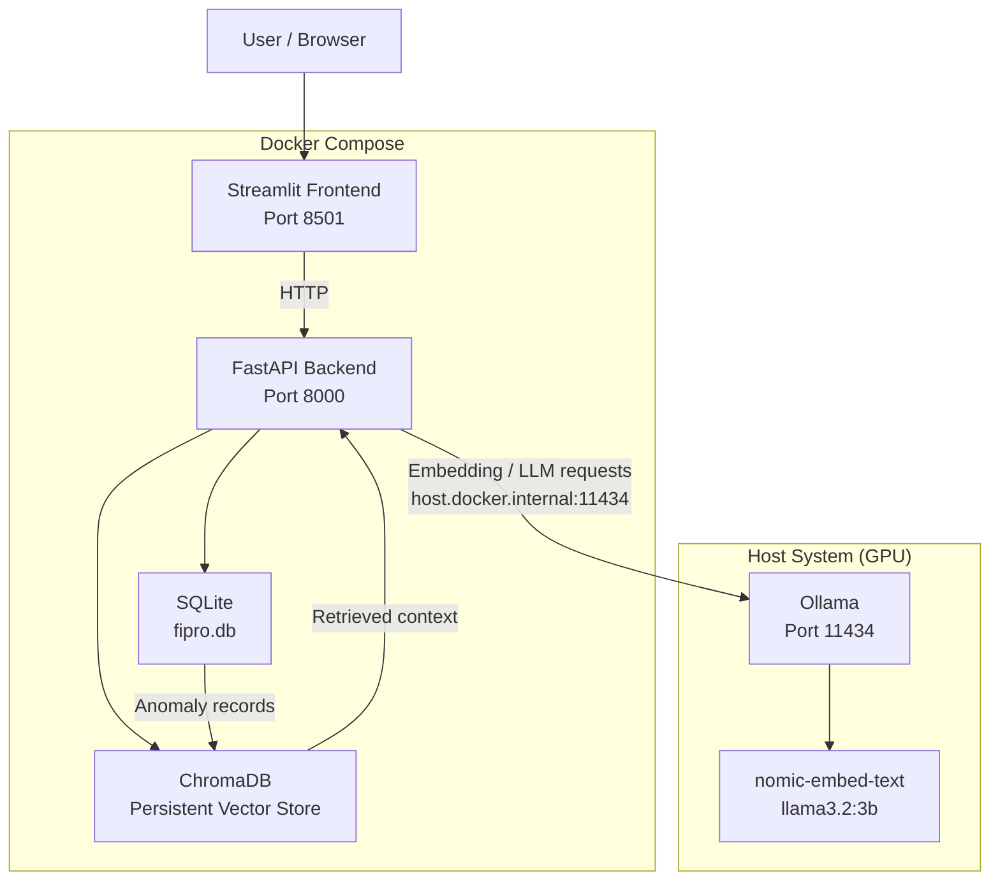

# Fipro: Stock Anomaly Detection Project

>[!WARNING]
>**Disclaimer:** Fipro is an educational and portfolio project intended primarily to demonstrate software engineering, machine learning, and RAG concepts. It is not a financial product, investment advisory service, trading system, or recommendation engine. The project does not provide personalized investment advice or instructions to buy, sell, or hold financial instruments. Any outputs generated by the system are experimental and should not be relied upon for investment or financial decisions. The author does not endorse or assume responsibility for investment decisions or other financial activities undertaken by users based on the project's outputs.


Fipro is a portfolio project exploring how **classical machine learning, statistical feature engineering, vector databases, and local LLMs** can be combined into a single financial analysis system.

The main idea is to separate **quantitative analysis** from **language generation**.

Instead of asking an LLM to directly analyze market data and perform financial calculations, Fipro uses statistical features and an unsupervised ML model to detect unusual market behavior. The resulting anomaly information is then indexed in a vector database and provided as context to a local LLM for natural-language reporting.

> **The ML pipeline determines what happened; the LLM explains it.**

This project was built for learning and portfolio purposes. It is **not intended for trading, investment advice, or real-world financial decision-making**.

---

## Architecture



---

## How It Works

Fipro can be viewed as four main stages:

```text
Market Data
     ↓
Feature Engineering
     ↓
Anomaly Detection
     ↓
RAG / LLM Reporting
```

### 1. Data Ingestion

Market data is retrieved using `yfinance` and stored in SQLite through SQLAlchemy.

The database acts as the source for the rest of the application.

### 2. Feature Engineering & Anomaly Detection

Three features are calculated from the market data:

* **Log Returns**
* **20-day Rolling Volatility**
* **Volume Z-Score**

These features are passed to a Scikit-learn `IsolationForest` configured with:

```python
contamination=0.03
```

The model identifies observations that are unusual within the engineered feature space.

### 3. Vectorization & Retrieval

Detected anomalies are converted into text descriptions and embedded using the local:

```text
nomic-embed-text
```

model through Ollama

The resulting embeddings are stored in ChromaDB.

This allows natural-language questions to retrieve semantically relevant anomaly events.
(I used default metric function of chromaDB which is euclidean distance: 
$$
 {d_2(x, y) = \|x - y\|_2 = \sqrt{\sum_{i=1}^{n} (x_i - y_i)^2}}
$$ 
 , but you can use cosine similarity just add "metadata={"hnsw:space": "cosine"}" to your get_anomaly_detection())
### 4. LLM Generation

Retrieved anomaly information is provided as context to:

```text
llama3.2:3b
```

running locally through Ollama.

The LLM is instructed to ground its responses in the retrieved anomaly information rather than independently performing financial analysis.

---

# Mathematical Features

## Log Return
For price \(P_t\):

$$
r_t = \ln\left(\frac{P_t}{P_{t-1}}\right)
$$

Log returns provide a scaled version of price changes.

---

## 20-Day Rolling Volatility

The rolling standard deviation of recent log returns is used as a local measure of market variability:

$$
\sigma_t =
std(r_{t-19}, ..., r_t)
$$

This provides a simple way of representing changes in recent market volatility.

---

## Volume Z-Score

Trading volume is normalized relative to its recent distribution:

$$
Z_t =
\frac{V_t-\mu_V}{\sigma_V}
$$

Higher values indicate unusually high trading activity.

---

# Technology Stack

| Component         | Technology         |
| ----------------- | ------------------ |
| Language          | Python             |
| API               | FastAPI            |
| Validation        | Pydantic V2        |
| ORM               | SQLAlchemy         |
| Database          | SQLite             |
| Data Processing   | Pandas, NumPy      |
| Machine Learning  | Scikit-learn       |
| Anomaly Detection | Isolation Forest   |
| Vector Database   | ChromaDB           |
| Embedding model   | `nomic-embed-text` |
| Local LLM         | `llama3.2:3b`      |
| Frontend          | Streamlit          |
| Visualization     | Plotly             |
| Containerization  | Docker             |
| Market Data       | yfinance           |

---

# Project Structure

```text
Fipro/
│
├── backend/
│   ├── app/
│   │   ├── api/
│   │   ├── core/
│   │   ├── ml/
│   │   ├── rag/
│   │   ├── schemas/
│   │   ├── models/
│   │   └── main.py
│   │
│   ├── Dockerfile
│   └── requirements.txt
│
├── frontend/
│   ├── app.py
│   ├── Dockerfile
│   └── requirements.txt
│
├── docker-compose.yml
└── README.md
```

The backend is separated into different responsibilities:

* `api/` — API routes
* `core/` — application configuration and infrastructure utilities
* `ml/` — feature engineering and anomaly detection
* `rag/` — embeddings, vector storage, and retrieval
* `models/` — SQLAlchemy database models
* `schemas/` — Pydantic API schemas

---

# API

The main backend operations are exposed through FastAPI.

| HTTP Method | Endpoint | Purpose |
| :--- | :--- | :--- |
| **POST** | `/api/ingest` | Fetch 2 years of OHLCV data from Yahoo Finance and store in SQLite |
| **POST** | `/api/detect` | Run feature engineering and Isolation Forest anomaly detection |
| **POST** | `/api/index-anomalies` | Vectorize anomaly events and upsert them into ChromaDB |
| **POST** | `/api/generate-report` | Execute semantic search and write risk briefings via Llama |
| **GET** | `/api/market-data/{ticker}` | Fetch raw price history to render the frontend candlestick chart |
| **GET** | `/api/anomalies/{ticker}` | Fetch detected anomalies to overlay warning markers on the chart |


---

# Docker & Deployment

Fipro uses Docker Compose to run the application components in separate containers.

The main application services are:

```text
Streamlit
    ↓
FastAPI
    ↓
SQLite / ChromaDB
```

Ollama runs on the host machine.

The containers communicate with the host Ollama through:

```text
host.docker.internal:11434
```
---

# Running Fipro

## Prerequisites

* Python 3.12+
* Docker Desktop
* Docker Compose
* Ollama

Pull the required models:

```bash
ollama pull nomic-embed-text
ollama pull llama3.2:3b
```

Then start the application:

```bash
docker compose up --build
```

The services are available at:

```text
Frontend:  http://localhost:8501
Backend:   http://localhost:8000
API Docs:  http://localhost:8000/docs
```

---

# Key Design Decisions

### Why Isolation Forest?

There is no labeled dataset defining which historical observations are "anomalies". Isolation Forest provides a simple unsupervised approach for identifying unusual observations.

### Why RAG?

The project uses RAG to retrieve relevant anomaly information before generating an answer rather than giving the LLM unrestricted access to the entire dataset.

This creates a clear separation between:

```text
Data / ML
    ↓
Retrieved evidence
    ↓
LLM generation
```

### Why a local LLM?

Local llms kind of sucks, especially when it comes to complicated mathematical problems. Since this project is just for my portfolio, rather than the performance of the llm i mainly focused on making a complete micro software tool.

---

# Project Scope

Fipro is primarily an **educational and portfolio project**.

The main goals were to gain experience with:

* Financial time-series feature engineering
* Unsupervised anomaly detection
* FastAPI application architecture
* SQLAlchemy and relational persistence
* Vector databases
* Embedding models
* Local LLM inference
* RAG pipelines
* Docker Compose
* Containers

**The system is not intended to provide investment recommendations or predict future asset prices.**

---

# What I Learned

Building Fipro provided practical experience connecting several different areas of modern ML engineering:

```text
Classical ML
     +
Backend Engineering
     +
Data Engineering
     +
Vector Search
     +
LLM/RAG
     +
Docker
```
>>>>>>> 74f7697 (initialize README)

